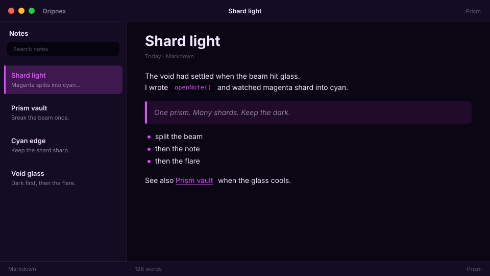

# Prism

Psychedelic dark. Prismatic magenta/cyan shards.



```
dripnex/theme-prism
```

## Palette

The chips live in [palette.html](palette.html) — open it in a browser. GitHub won’t paint HTML swatches here, so the hex list is below.

| Name | Token | Color | What it’s for |
| --- | --- | --- | --- |
| Base | `--bg-base` | `#0a0614` | Window background |
| Surface | `--bg-surface` | `#140c22` | Sidebar and chrome |
| Elevated | `--bg-elevated` | `#1e1432` | Raised panels |
| Text | `--text-primary` | `#f2e8ff` | Headings and body |
| Muted | `--text-muted` | `#f2e8ff · rgba(242, 232, 255, 0.52)` | Secondary copy |
| Accent | `--accent` | `#e14dff` | Selection and links |
| Active | `--status-active` | `#e14dff` | Active status |
| Dropped | `--status-dropped` | `#ff5a7a` | Dropped status |

Pick it when you want prismatic magenta shards on void.
